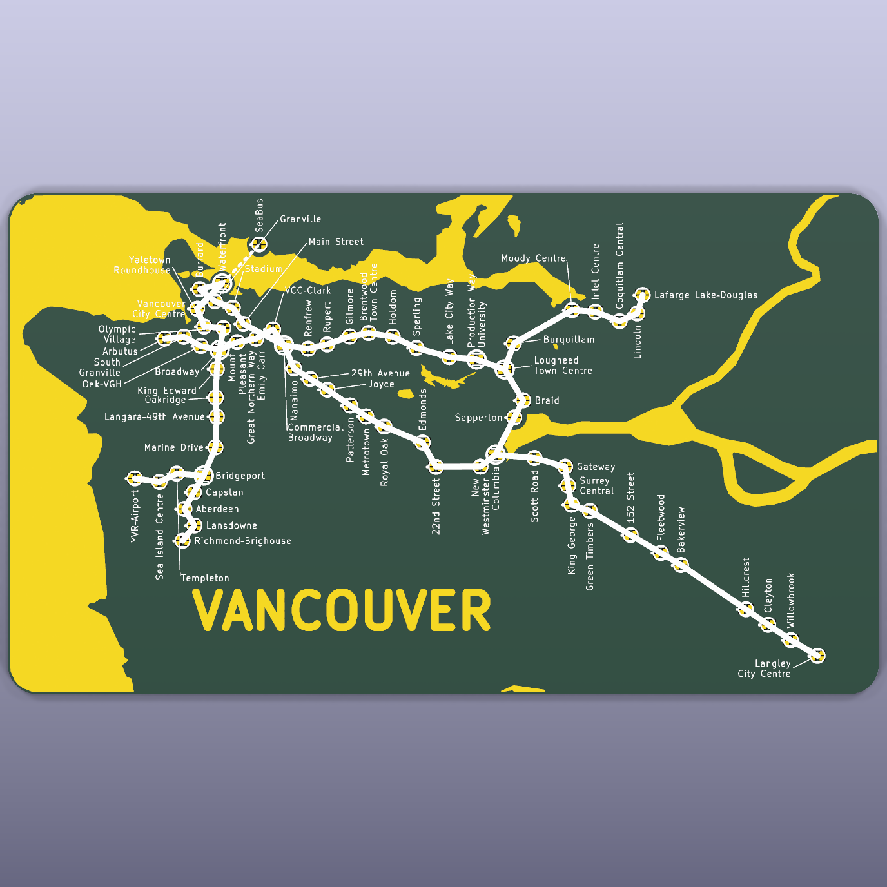

# Vancouver SkyTrain PCB

A printed circuit board that is a map of Metro Vancouver's SkyTrain network,
with one addressable RGB LED per station. Based on
[Idea022 Translink Map PCB](https://blog.abluestar.com/idea022-translink-map-pcb/).

| Version | Where | What |
|---|---|---|
| **v3 (current)** | [`ai-v3/`](ai-v3/) | 200 × 109 mm board, real geography from the BC Freshwater Atlas, station positions from OpenStreetMap, 68 WS2812B LEDs (every current and under-construction station + SeaBus), XIAO controller footprint on the back, generated end-to-end from a data file |
| v2 | [`v2/`](v2/) | 100 × 83 mm schematic-style board, artwork drawn in Inkscape and imported with svg2shenzhen |
| v1 | [`v1/`](v1/) | 320 × 210 mm board with two LEDs per station (one per direction), ESP32 |



## v3 in one paragraph

Everything on the v3 board — LED placement, the exposed-copper water, the
silkscreen routes, station rings and labels, the copper city names and
wordmark — is generated from one data file, `ai-v3/input/vancouver.json`, by
the scripts in `ai-v3/tools/`. The data file is itself built from public
sources (`ai-v3/input/build_from_fwa.py`): the province's Freshwater Atlas
for land, sea, rivers and lakes; OpenStreetMap for station positions; the
province's ABMS layer for the UBC boundary. Labels are laid out by an
optimiser and then finished by hand in KiCad, and the hand edits are pulled
back into the data file so nothing is ever lost to a regeneration.

## Pipeline (v3)

All commands run from `ai-v3/tools/` unless noted. Python 3 with `shapely`,
`numpy`, `scipy`, `pillow`, `matplotlib`; KiCad 10 (its `kicad-cli` is used
for DRC and renders).

### 1. Data

```
cd ai-v3/input
python geo_fwa.py                 # (optional) preview the geography alone -> ../test-results/geo-preview.png
python build_from_fwa.py          # geography + stations + city labels + wordmark -> vancouver.json
cd ../tools
python test_vancouver_data.py     # LED count, chain, pitch, margins
```

`build_from_fwa.py` keeps every station's `label` and the `suppressed_art`
list, so it is safe to re-run after hand edits.

### 2. Labels

```
python auto_label.py                       # greedy placement + simulated annealing
python preview_map.py ../input/vancouver.json ../test-results/preview.png --collisions
python check_fit.py ../input/vancouver.json --scale 2.0 -v
```

`preview_map.py` draws the board exactly as the exporter will (matplotlib,
no KiCad); the red overlay marks collisions.

### 3. Board

```
python export_placement.py ../input/vancouver.json ../hardware --scale 2.0
python reposition_board.py ../hardware/vancouver-skytrain-pcb.kicad_pcb ../hardware/leds.csv --board 200 --height 109
python export_art.py ../input/vancouver.json ../hardware/vancouver-skytrain-pcb.kicad_pcb --scale 2.0
python render_board.py ../hardware/vancouver-skytrain-pcb.kicad_pcb ../test-results
```

`export_art.py` is idempotent: it records every block it writes (uuid → key)
in `vancouver-skytrain-pcb.kicad_pcb.art-manifest.json` and removes them
before writing fresh ones.

### 4. Hand edits in KiCad → back into the data (**import before export**)

Station labels, leader lines and copper text are ordinary `gr_text` /
`gr_line` items. Move, rotate, re-justify, retext or delete them in KiCad,
save, then:

```
python import_labels.py ../input/vancouver.json ../hardware/vancouver-skytrain-pcb.kicad_pcb
```

Each item is found by its deterministic uuid, so the import is exact:

| You did in KiCad | Lands in `vancouver.json` as |
|---|---|
| moved / rotated / re-justified a station label | `label.dx` `dy` `angle` `anchor` (`start` / `end` / `center`) |
| deleted a leader line | leader dropped (`leader` absent) |
| edited a label's text (line break, shorter name) | station `wrap` list, or `label.short` |
| moved a city name or the wordmark | `annotations[i].x` / `y` |
| deleted a piece of generated art (SeaBus dash, route segment, boundary) | key added to `suppressed_art`; the exporter skips it from then on |

**Always run `import_labels.py` before `export_art.py`** — the exporter
regenerates every label from the data file and would otherwise overwrite
the board's hand edits. `import → export` reproduces the board exactly.

## Lessons learned

See [lessons-learned.md](lessons-learned.md) — what to carry into the next
board of this kind, and the mistakes not to repeat.
